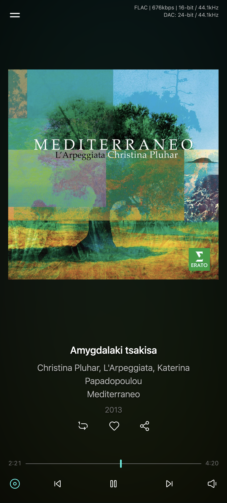
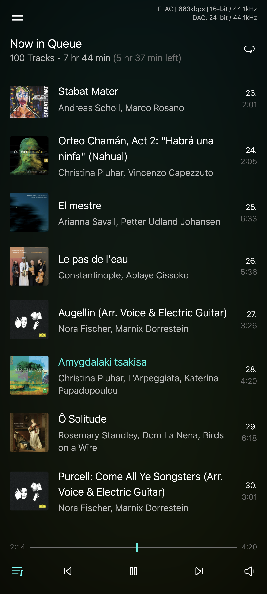
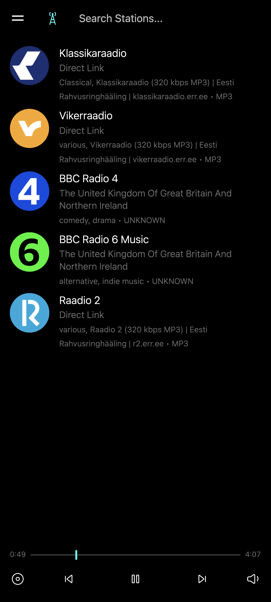
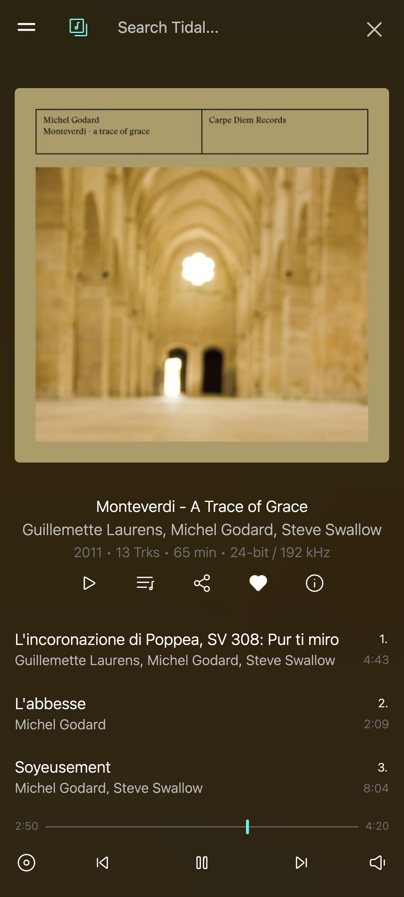
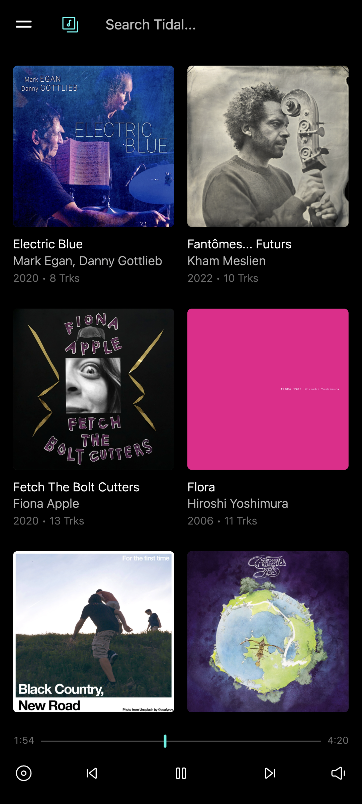
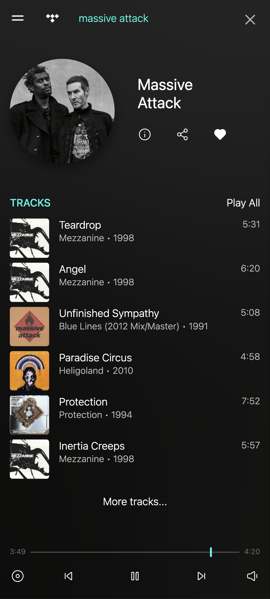
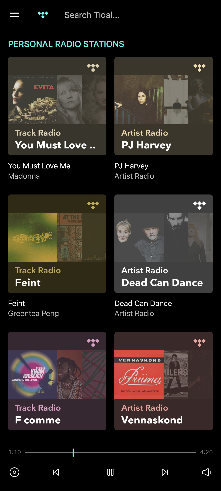
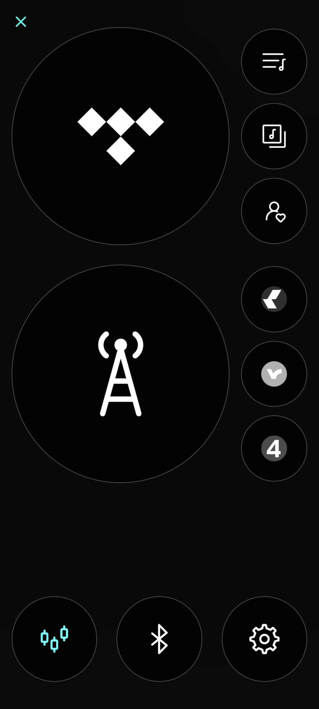
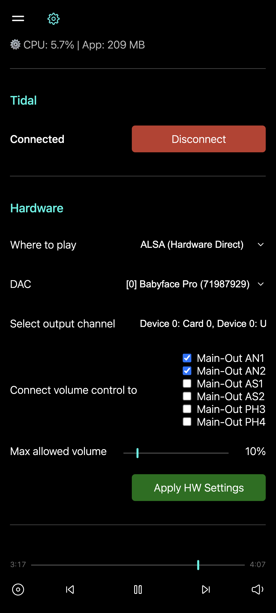

# Miliza

**Miliza is a standalone streamer software. It can play Tidal streams and internet radio.**
<br>Run it in your media server and access over web interface in local network.

Integrates with the Tidal through EbbLabs/python-tidal API.
<br>Finding internet radios throguh radio-browser.info and plays from direct links.

Try it out on your Raspberry PI or some other ARM64 or x86_64 Linux machine.

## ⚠️ Disclaimer
**This project has no relation to the official Tidal music app, nor is it endorsed by Tidal in any way.**

**As-Is Software:** This software is free to use but comes with **no warranty or guarantee** of functionality on your personal system. Use it at your own risk.

For now, this is an Alpha state software. It's not meant to be 100% solid and have all the functionality one can wish for.
<br>Discussion over functionality, features, and bugs: https://github.com/t3brightside/miliza_server/issues

## 🔽 Download
This repository is for documentation and bug tracking only.
<br>Binary downloads are available on the website: **https://miliza.eu**

## ✨ Features
For now there is two compiled versions. One compiled on ARM64 Debian and other on x86_64 Ubuntu.

Being a personal hobby project the releases are fairly irregular and versioned just by the date and time.

* **Standalone Binary:** Compiled into a single executable for easy deployment.
* **Tidal Integration:** Access your favorite Tidal tracks, playlists, and albums. Hi-res playback.
* **Online radio stations** Search stations, and listen to direct stream links. 
* **Hardware Audio:** Direct ALSA output and Bluetooth routing support.
* **Web UI:** Accessible via web browser in local network (Chrome only for now).

### Selected features:
* Hi-Res playback.
* Tidal search with search history.
* Show and add media from personal Tidal database, albums, artists, playlists, mixes, etc.
* Share, tracks, albums, lists, etc. Find content using sharelinks.
* Basic queue handling.
* Lyrics.
* 10-band EQ.
* Technical file and playback information.
* Selectable DAC, bluetooth and browser output.
* Selectable volume control for DAC hardware.
* Bluetooth control, power, pairing. Multidevice connectivity.

## 📱 Screens
  <a href="screenshots/now_playing.png"></a>
  <a href="screenshots/queue.png"></a>
  <a href="screenshots/radio_stations.png"></a>
  <a href="screenshots/tidal_album.png"></a>
  <a href="screenshots/tidal_albums.png"></a>
  <a href="screenshots/tidal_artist.png"></a>
  <a href="screenshots/tidal_mixes.png"></a>
    <a href="screenshots/menu.png"></a>
  <a href="screenshots/settings.png"></a>


## 🛠️ 1. System Prerequisites

Even though Miliza is packaged as a standalone binary, it relies on system-level C-libraries for audio playback and Bluetooth management. **GStreamer**, **ALSA**, and **BlueZ** must be installed on the host system before running the app.

## DietPi on Raspberry Pi
Write your self a DietPi flashed card. Replace **dietpi_helpers/dietpi.txt** in the root of the card and pop it in your Raspberry Pi. Wait for a while and you should be ready to go.

Just visit http://miliza.local in your local network. http://miliza.local/miliza.crt gives you the cert to install to your phone and computer for full https access to go PWA mode.

## Some guidance for manual install

**The following is not a complete guide but helps you get things running.**

### On Debian/Ubuntu-based system:

```bash
export PYTHONIOENCODING=utf-8

sudo apt install libgirepository-2.0-0
sudo apt install alsa-utils bluez bluez-tools
sudo apt install gstreamer1.0-plugins-base gstreamer1.0-plugins-good gstreamer1.0-plugins-ugly gstreamer1.0-alsa
sudo apt install liborc-0.4-0 liborc-0.4-dev libasound2-plugins gstreamer1.0-plugins-bad gstreamer1.0-libav

### Bluetooth Configuration
To allow Miliza to manage Bluetooth devices, ensure the Bluetooth service is running and your user has the correct permissions:

# Enable and start the Bluetooth service
sudo systemctl enable --now bluetooth

# Add your user to the bluetooth group
sudo usermod -aG bluetooth $USER

# Restart the service to apply changes
sudo systemctl restart bluetooth
```
*(Note: You may need to log out and log back in for the group changes to take effect).*

### On Alpine-based system:

```bash
# Update repositories
apk update

# Install ALSA and Bluetooth
apk add alsa-utils alsa-lib bluez bluez-tools dbus

# Install GStreamer and its plugins
apk add gstreamer gst-plugins-base gst-plugins-good gst-plugins-bad gst-plugins-ugly gst-libav

# Install GObject Introspection (equivalent to libgirepository-2.0-0)
apk add gobject-introspection

# Add services to start automatically on boot
rc-update add dbus default
rc-update add bluetooth default
rc-update add alsa default

# Start them right now
rc-service dbus start
rc-service bluetooth start
rc-service alsa start
```


## 🚀 2. Running Miliza

Since Miliza is compiled into a single executable, you don't need to install Python or set up virtual environments on the target machine.

There are 2 binaries available for now.
* **x86_64** compiled on Ubuntu
* **aarch64** compiled on Debian.

1. **Run the server:**
   ```bash
   ./miliza_server_alpha_arm64_202603141200
   ```

2. **Access the Interface:**
   Once the backend starts, open a web browser and navigate to:
   ```text
   http://IP-ADDRESS:5000
   ```

## 🔈 Usage

Go to Settings. Auth for Tidal. Set the output hardware and try it out.


## 📝 License

**This software is provided free of charge for personal use only.**

The software is distributed as-is, without any warranty of any kind. By using this software, you acknowledge that you do so at your own risk, and the author assumes no liability for any damages, legal issues, or other consequences arising from its use.

Commercial use, selling, or redistributing this software in any form is not permitted.